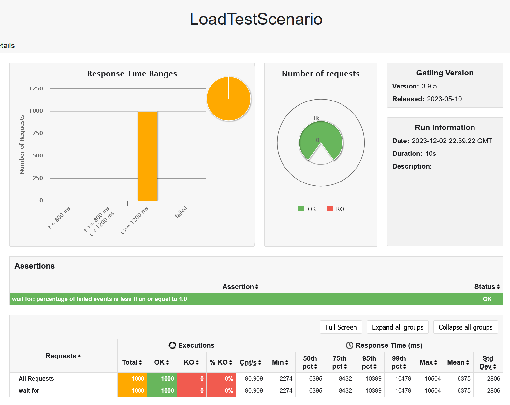
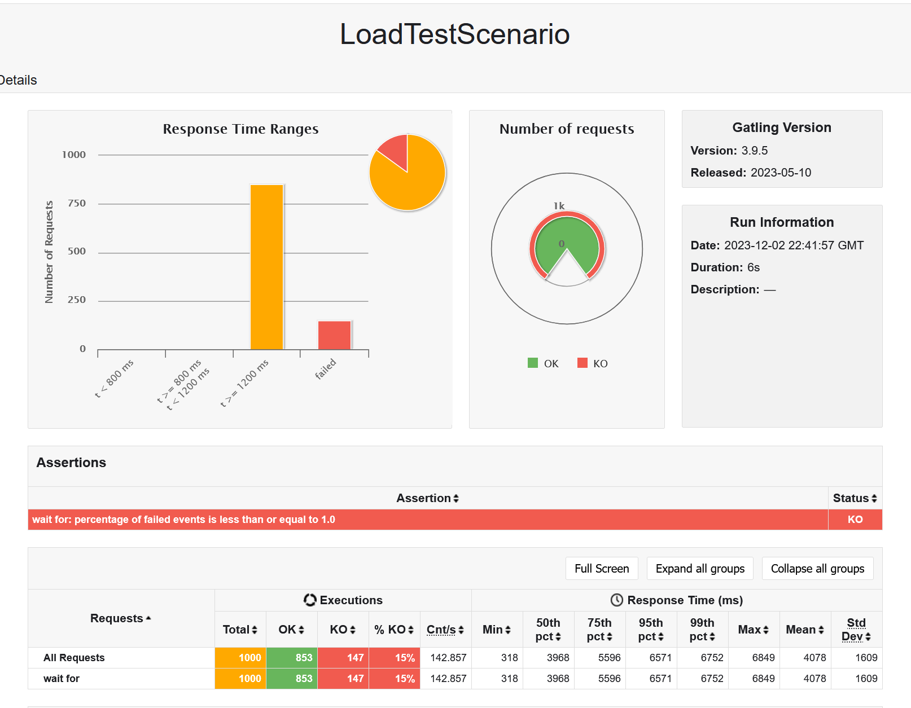

# Virtual Threads Load Testing with Gatling demo


Run blocker and waiter:
`````shell
./mvnw spring-boot:run
`````
`````shell
./mvnw spring-boot:test-run
`````

Run gatling tests:
````shell
./mvnw gatling:test
````

Results:

With virtual threads 15% of requests failed. What's happening?
[Virtual threads off 1000 concurrent users](/vt-off-1000)

[Virtual threads on 1000 concurrent users](/vt-on-1000)


